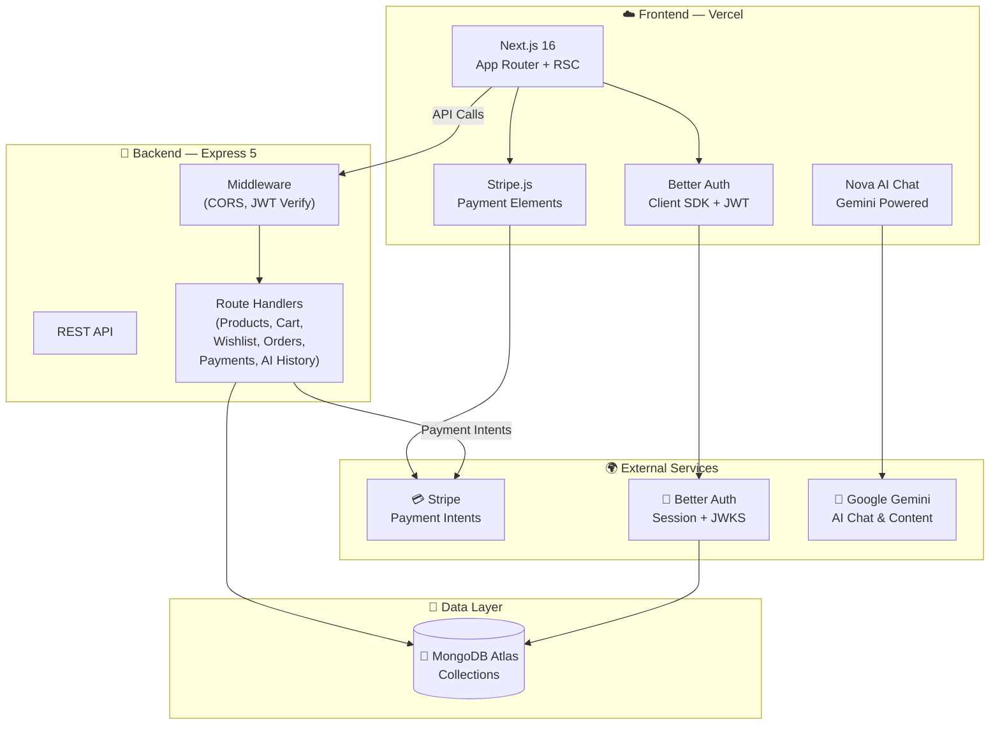

<div align="center">

# 🛍️ NovaCart

### Premium AI-Powered Clothing Store

A **production-grade** e-commerce platform with multi-role authentication, AI-powered chat & content generation, Stripe payments, wishlist & cart management, and a stunning light/dark mode UI.

&nbsp;

[](https://nextjs.org/)
[](https://react.dev/)
[](https://tailwindcss.com/)
[](https://www.mongodb.com/)
[](https://stripe.com/)
[](https://expressjs.com/)
[](https://www.better-auth.com/)
[](https://ai.google.dev/)

&nbsp;

🌍 [**Live Demo**](https://novacart-client.vercel.app/) &nbsp;·&nbsp; 📦 [**Client Repo**](https://github.com/ashiqurrhmn/NovaCart-client) &nbsp;·&nbsp; 🔌 [**Server Repo**](https://github.com/ashiqurrhmn/NovaCart-server)

</div>

---

## 📖 Table of Contents

- [Overview](#-overview)
- [Screenshots](#-screenshots)
- [Why NovaCart Stands Out](#-why-novacart-stands-out)
- [Demo Accounts](#-demo-accounts)
- [Tech Stack](#-tech-stack)
- [Key Features](#-key-features)
- [Roadmap](#-roadmap)
- [Architecture](#-architecture)
- [Project Structure](#-project-structure)
- [Getting Started](#-getting-started)
- [Environment Variables](#-environment-variables)
- [Deployment](#-deployment)
- [API Endpoints Reference](#-api-endpoints-reference)
- [Contributing](#-contributing)
- [License](#-license)
- [Author](#-author)

---

## 🎯 Overview

**NovaCart** is a fully-featured AI-powered clothing e-commerce platform connecting **Buyers** and **Admins** through a modern, responsive shopping experience. Built with Next.js 16's App Router and React Server Components on the frontend, backed by an Express 5 REST API and MongoDB, it delivers a complete shopping ecosystem — from browsing curated fashion collections and AI-assisted product discovery to secure Stripe-powered checkout, wishlist management, and full admin oversight.

---

## 📸 Screenshots

<!-- Replace with your actual screenshot -->


---

## ✨ Why NovaCart Stands Out

| | Feature | Description |
|---|---|---|
| 🤖 | **AI Chat Assistant** | Built-in "Nova" chatbot powered by Gemini AI helps users discover products, track orders, and get fashion recommendations |
| ✍️ | **AI Content Studio** | Admin tool for generating blog posts, product descriptions, social media copy, and documentation using AI |
| 💳 | **Stripe Integration** | Secure payment processing with Stripe Payment Intents for seamless checkout |
| 🔐 | **Better Auth + JWT** | Email/password and Google social auth with JWT-based API protection and role-based access control |
| 👥 | **Multi-Role RBAC** | Two distinct roles — Buyer and Admin — each with isolated dashboards and permissions |
| 📊 | **Analytics Dashboards** | Interactive Recharts visualizations: sales trends, order analytics, and platform statistics |
| 🎨 | **Light & Dark Mode** | Premium dual-theme design with warm earth tones (light) and sleek dark aesthetic |
| ❤️ | **Wishlist & Cart** | Server-synced wishlist and cart with optimistic UI updates for instant feedback |
| 🔍 | **Smart Product Discovery** | Filter by category, search by keyword, sort by price — all with a beautiful responsive shop page |

---

## 🔑 Demo Accounts

Experience the platform from different perspectives using these test accounts:

**🛒 Buyer**
- **Email:** `user@gmail.com`
- **Password:** `12345Asdf`

**🛡️ Admin**
- **Email:** `admin@gmail.com`
- **Password:** `12345Asdf`

---

## 🔧 Tech Stack

### Frontend

| Technology | Version | Purpose |
|---|---|---|
| **Next.js** | 16 | App Router, React Server Components, API Routes |
| **React** | 19 | UI library with concurrent features |
| **Tailwind CSS** | v4 | Utility-first responsive styling |
| **Lucide React** | Latest | Beautiful, consistent icon system |
| **Framer Motion** | 12.x | Page transitions, hover effects, micro-animations |
| **Better Auth** | 1.6+ | Authentication with MongoDB adapter + JWT plugin |
| **Recharts** | 3.x | Interactive data visualization for dashboards |
| **Stripe.js** | 9.x | Client-side Stripe Elements for payment forms |
| **Swiper** | 14.x | Smooth touch-enabled testimonial sliders |
| **next-themes** | 0.4+ | Light/dark mode theme management |

### Backend

| Technology | Version | Purpose |
|---|---|---|
| **Node.js + Express** | 5.x | High-performance REST API server |
| **MongoDB** | 7.x | NoSQL database via native driver (no ORM overhead) |
| **Stripe SDK** | 22.x | Server-side Payment Intent creation |
| **jose-cjs** | 6.x | JWT verification via JWKS for secure API routes |
| **CORS + Dotenv** | Latest | Middleware and environment configuration |

---

## 🔑 Key Features

### 🔒 Authentication & Authorization
- Email/password registration and Google Sign-in via **Better Auth**
- Role-based access: **Buyer** and **Admin** with isolated dashboards
- JWT-based API protection using JWKS verification
- Secure session handling with MongoDB-backed persistence
- Route protection with role-based redirects and access-denied pages

### 🔍 Product Discovery & Browsing
- Full-text search by **keyword** and dynamic **category filtering** (Men, Women, Kids)
- Beautiful product cards with hover effects and quick-add actions
- Dedicated product detail pages with image galleries and sizing info
- Curated collection sections and featured product highlights on the landing page
- Responsive shop page with grid/list layouts

### 🛒 Cart & Wishlist
- Server-synced cart with quantity management (add, update, remove, clear)
- Persistent wishlist with one-click toggle from any product card
- Optimistic UI updates for instant user feedback
- Cart badge counts in the navbar
- Admin users are restricted from cart/wishlist actions

### 💳 Checkout & Payments
- Multi-step checkout flow: Delivery Address → Stripe Payment → Order Confirmation
- Secure payment processing via Stripe Payment Intents
- Automatic order creation upon successful payment
- Order history tracking for buyers

### 🤖 AI-Powered Features

**Nova Chat Assistant**
- Floating chat widget available on every page
- Powered by Groq AI
- Suggested prompts for quick interactions
- Helps with product recommendations, order tracking, and general queries

**AI Content Studio (Admin)**
- Generate blog articles, product descriptions, documentation, and social media posts
- Adjustable output length (Short / Medium / Long)
- One-click copy to clipboard
- Generation history saved per admin user

### 📊 Role-Specific Dashboards

**🛒 Buyer Dashboard**
- Order history with status tracking (Processing → Shipped → Delivered)
- Profile management with avatar and personal info
- Quick stats: total orders, total spent, pending orders

**🛡️ Admin Dashboard**
- Platform-wide statistics: total products, users, orders, and revenue
- Full product CRUD: add, edit, delete products with image URLs
- Order management with status update dropdowns
- User management: view all users, delete accounts
- Payment history overview
- AI Content Studio for marketing content generation
- Interactive charts: revenue trends, order analytics via Recharts

### 💅 UI/UX & Design
- **Dual-theme design** with warm earth tones (`#f5f0eb`) and sleek dark mode (`#111111`)
- Floating glassmorphic navbar with `backdrop-blur-xl`
- Hero section with layered typography and model imagery
- Marquee banner, FAQ accordion, testimonials slider
- Responsive across all breakpoints (mobile → tablet → desktop)
- Loading states and error boundaries throughout
- Custom 404 and error pages

---

## 🗺️ Roadmap

- [ ] **Order Notifications:** Real-time email/push notifications for order status updates
- [ ] **Product Reviews:** Allow buyers to rate and review purchased products
- [ ] **Social Sharing:** Built-in sharing tools for X (Twitter), Facebook, and LinkedIn
- [ ] **Size Recommendations:** AI-powered size suggestions based on user preferences
- [ ] **Multi-Currency Support:** Auto-conversion for global shoppers

---

## 🏗️ Architecture



### Database Collections

| Collection | Purpose |
|---|---|
| `user` | User accounts with roles (buyer/admin), managed by Better Auth |
| `products` | Product listings with name, price, category, images, and descriptions |
| `cart` | Per-user shopping cart with item quantities |
| `wishlist` | Per-user saved/favorited products |
| `orders` | Order records with items, address, payment status, and delivery status |
| `ai-history` | Saved AI content generation history per admin user |

---

## 📁 Project Structure

```
NovaCart-client/
├── app/
│   ├── api/
│   │   └── auth/                   # Better Auth handler
│   ├── (dashboard)/                # Role-based dashboards
│   │   ├── admin/dashboard/        # Admin dashboard
│   │   │   ├── add-product/        # Add new product
│   │   │   ├── edit-product/       # Edit existing product
│   │   │   ├── products/           # Product management
│   │   │   ├── orders/             # Order management
│   │   │   ├── users/              # User management
│   │   │   ├── payments/           # Payment overview
│   │   │   ├── ai-content/         # AI Content Studio
│   │   │   └── page.tsx            # Admin dashboard home
│   │   └── buyer/dashboard/        # Buyer dashboard
│   │       ├── orders/             # Order history
│   │       ├── profile/            # Profile settings
│   │       └── page.tsx            # Buyer dashboard home
│   ├── cart/                       # Shopping cart page
│   ├── checkout/                   # Multi-step checkout
│   ├── context/                    # React contexts
│   │   ├── cart-context.tsx        # Cart state management
│   │   └── wishlist-context.tsx    # Wishlist state management
│   ├── login/                      # Sign-in page
│   ├── signup/                     # Sign-up page
│   ├── product/[id]/               # Dynamic product detail
│   ├── shop/                       # Shop catalog page
│   ├── wishlist/                   # Wishlist page
│   ├── about/                      # About page
│   ├── access-denied/              # 403 redirect page
│   ├── lib/                        # Utilities & Config
│   │   ├── auth.ts                 # Better Auth server config
│   │   └── auth-client.ts          # Better Auth client hooks
│   ├── layout.tsx                  # Root layout with providers
│   ├── page.tsx                    # Landing page
│   ├── not-found.tsx               # Custom 404
│   └── error.tsx                   # Error boundary
├── components/
│   ├── navbar.tsx                  # Floating glassmorphic navbar
│   ├── footer.tsx                  # Site footer
│   ├── hero-section.tsx            # Landing hero with model image
│   ├── category-section.tsx        # Category browsing
│   ├── collection-section.tsx      # Featured collections
│   ├── featured-cards.tsx          # Highlighted products
│   ├── chat-widget.tsx             # Nova AI chat assistant
│   ├── shop-page-client.tsx        # Shop page with filters
│   ├── product-card.tsx            # Reusable product card
│   ├── dashboard-sidebar.tsx       # Dashboard navigation
│   ├── theme-provider.tsx          # Theme context provider
│   ├── theme-toggle.tsx            # Light/dark mode toggle
│   ├── marquee-banner.tsx          # Scrolling brand banner
│   ├── faq-section.tsx             # FAQ accordion
│   ├── testimonials-section.tsx    # Testimonial slider
│   └── vibe-section.tsx            # Lifestyle imagery section
├── public/                         # Static assets & images
└── package.json
```

```
NovaCart-server/
├── index.ts                        # Express 5 API (all routes + middleware)
├── package.json
└── .env                            # Environment variables
```

---

## 🚀 Getting Started

### Prerequisites

- **Node.js** v18+ (v22 recommended)
- **MongoDB** cluster ([MongoDB Atlas](https://www.mongodb.com/atlas) recommended)
- **Stripe Account** with API keys ([stripe.com](https://stripe.com))

### Installation

```bash
# ── 1. Clone both repositories ──────────────────────────────

git clone https://github.com/ashiqurrhmn/NovaCart-client.git
git clone https://github.com/ashiqurrhmn/NovaCart-server.git

# ── 2. Set up the Backend ───────────────────────────────────

cd NovaCart-server
npm install

# Create .env file (see Environment Variables section below)

# Start the server
npm run dev
# → Server runs on http://localhost:5000

# ── 3. Set up the Frontend ──────────────────────────────────

cd ../NovaCart-client
npm install

# Create .env file (see Environment Variables section below)

# Start development server
npm run dev
# → Frontend runs on http://localhost:3000
```

---

## 🔐 Environment Variables

### Frontend (`NovaCart-client/.env`)

```env
# MongoDB connection (used by Better Auth)
MONGODB_URI=mongodb+srv://<user>:<password>@<cluster>.mongodb.net

# Better Auth
BETTER_AUTH_SECRET=your-secret-key
BETTER_AUTH_URL=http://localhost:3000

# Google OAuth
GOOGLE_CLIENT_ID=your-google-client-id
GOOGLE_CLIENT_SECRET=your-google-client-secret

# Backend API URL
NEXT_PUBLIC_API_URL=http://localhost:5000

# Stripe
STRIPE_SECRET_KEY=sk_test_...
NEXT_PUBLIC_STRIPE_PUBLISHABLE_KEY=pk_test_...

# Gemini AI
GEMINI_API_KEY=your-gemini-api-key
```

### Backend (`NovaCart-server/.env`)

```env
# MongoDB
MONGODB_URI=mongodb+srv://<user>:<password>@<cluster>.mongodb.net

# CORS — Client URL
CLIENT_URL=http://localhost:3000

# Stripe
STRIPE_SECRET_KEY=sk_test_...

# Server
PORT=5000
```

---

## 🌐 Deployment

| Service | Purpose | Details |
|---|---|---|
| **Vercel** | Next.js Frontend | Auto-deploy from GitHub, edge-optimized |
| **Node.js Hosting** | Express API Server | Any Node.js host (Render, Railway, VPS) |
| **MongoDB Atlas** | Database | Cloud-hosted NoSQL with free tier |
| **Stripe** | Payments | Test mode for development, live keys for production |

### Deploy Frontend to Vercel

```bash
# Install Vercel CLI
npm i -g vercel

# Deploy
vercel --prod
```

> **Note**: Set all frontend environment variables in the Vercel dashboard under **Settings → Environment Variables**.

---

## 🗺️ API Endpoints Reference

### Products

| Method | Endpoint | Auth | Description |
|---|---|---|---|
| `GET` | `/products` | Public | List all products |
| `GET` | `/products/:id` | Public | Get single product details |
| `POST` | `/products` | Admin | Add a new product |
| `PUT` | `/products/:id` | Admin | Update a product |
| `DELETE` | `/products/:id` | Admin | Delete a product |

### Users

| Method | Endpoint | Auth | Description |
|---|---|---|---|
| `GET` | `/users` | Admin | List all users |
| `DELETE` | `/users/:id` | Admin | Delete a user |

### Cart

| Method | Endpoint | Auth | Description |
|---|---|---|---|
| `GET` | `/cart/:userId` | User | Get user's cart |
| `POST` | `/cart/:userId/add` | User | Add item to cart |
| `PUT` | `/cart/:userId/item/:itemId` | User | Update item quantity |
| `DELETE` | `/cart/:userId/item/:itemId` | User | Remove item from cart |
| `DELETE` | `/cart/:userId/clear` | User | Clear entire cart |

### Wishlist

| Method | Endpoint | Auth | Description |
|---|---|---|---|
| `GET` | `/wishlist/:userId` | User | Get user's wishlist |
| `POST` | `/wishlist/:userId/add` | User | Add item to wishlist |
| `DELETE` | `/wishlist/:userId/item/:itemId` | User | Remove item from wishlist |

### Orders & Payments

| Method | Endpoint | Auth | Description |
|---|---|---|---|
| `POST` | `/create-payment-intent` | User | Create Stripe Payment Intent |
| `POST` | `/orders` | User | Create a new order |
| `GET` | `/orders/:userId` | User | Get user's order history |
| `GET` | `/admin/orders` | Admin | Get all orders |
| `PATCH` | `/admin/orders/:orderId/status` | Admin | Update order status |

### AI

| Method | Endpoint | Auth | Description |
|---|---|---|---|
| `POST` | `/ai-history` | User | Save AI generation to history |
| `GET` | `/ai-history/:email` | User | Get user's AI generation history |

---

## 🤝 Contributing

Contributions, issues, and feature requests are welcome!

1. Fork the project
2. Create your feature branch (`git checkout -b feature/AmazingFeature`)
3. Commit your changes (`git commit -m 'Add some AmazingFeature'`)
4. Push to the branch (`git push origin feature/AmazingFeature`)
5. Open a Pull Request

---

## 📜 License

Distributed under the MIT License. See `LICENSE` for more information.

---

## 👤 Author

<div align="center">

**Built with 🔥 by [Md. Ashiqur Rahman](https://ashiqur-portfolio0.vercel.app/)**

&nbsp;

[](https://ashiqur-portfolio0.vercel.app/)
[](https://github.com/ashiqurrhmn)
[](https://www.linkedin.com/in/ashiqur-rahman00/)
[](mailto:ashiqur1312@gmail.com)

</div>

---

<div align="center">

### ⭐ If you found this helpful, give it a star!

**Built with ❤️ using Next.js 16, Express 5, MongoDB, Stripe & Gemini AI**

&nbsp;

[](https://github.com/ashiqurrhmn/NovaCart-client)
[](https://github.com/ashiqurrhmn/NovaCart-server)

&nbsp;

<sub>© 2026 NovaCart. All rights reserved.</sub>

</div>
